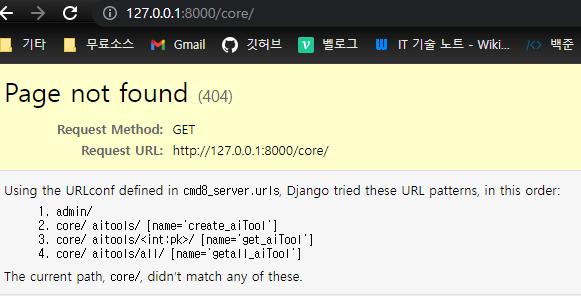
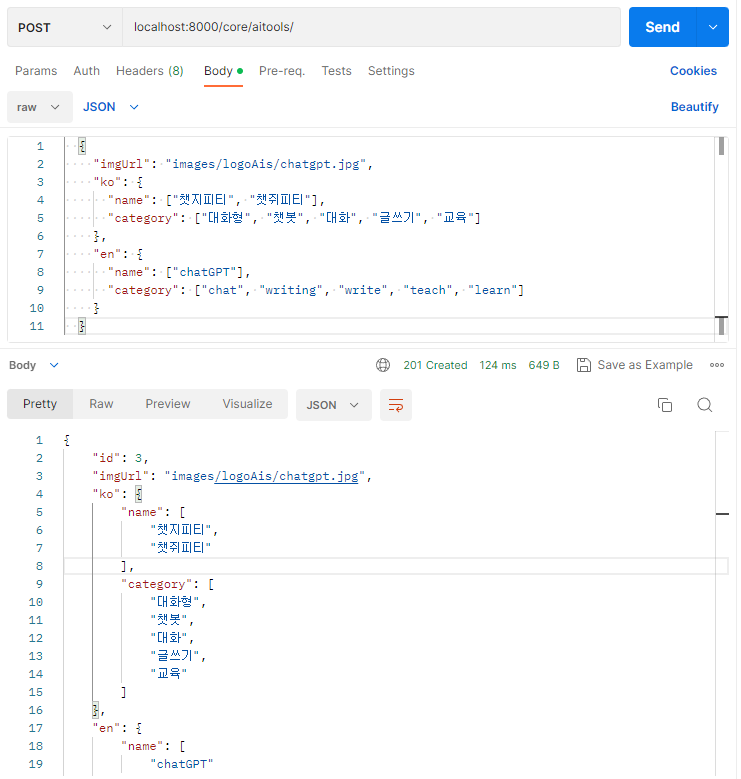
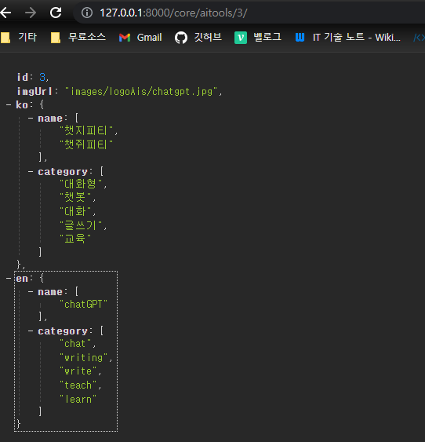
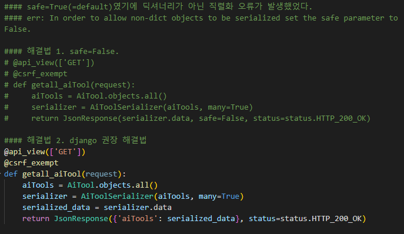
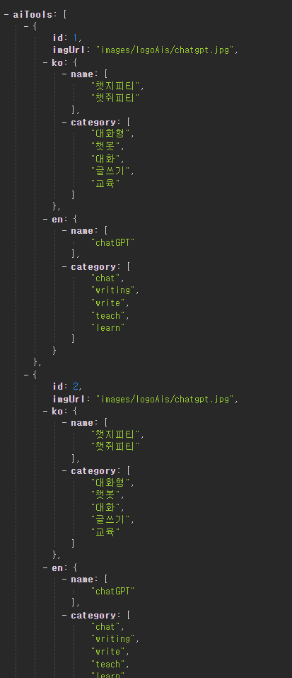

# BackEnd DevNote

## [ 04.04 ]

## [ 04.03 ]

### 1. Django init & 기본설정

### 2. core 하위 앱 추가, mvp수준 models,serializers,views,urls 작성
1. AiTools 모델 작성
	- AiTools 이외, AI순위 등 다룰 수 있으므로 확장성 고려한 interface 설계,활용
   - AiTools 모델은 id, imgUrl, ko, en 필드를 가져야 함.
   - ko와 en 필드는 JSON 데이터를 저장해야 함. 
     - : Django의 JSONField를 사용하여 JSON 데이터를 저장할 수 있음.
```python
#models.py
from django.db import models
from django.contrib.postgres.fields import JSONField

class CommonInfo(models.Model):
    id = models.CharField(max_length=10)
    imgUrl = models.CharField(max_length=255)
    ko = JSONField()
    en = JSONField()
    
    class Meta:
        abstract = True

class MyModel(models.Model):
    id = models.CharField(max_length=10)
    imgUrl = models.CharField(max_length=255)
    ko = JSONField()
    en = JSONField()
```

2. serializers.py 작성
	- AiTools을 직렬화하고 역직렬화하기 위해 serializers.py 파일을 작성
	- en, ko 각각은 name과 category 하위 필드(string[])를 가지는 json이므로
    	- 이들 또한, 하위 직렬화해주는 코드도 작성
```python
#serializers.py

from rest_framework import serializers
from .models import AiTool

class NameCategorySerializer(serializers.Serializer):
    name = serializers.ListField(child=serializers.CharField())
    category = serializers.ListField(child=serializers.CharField())


class AiToolSerializer(serializers.ModelSerializer):
    ko = NameCategorySerializer()
    en = NameCategorySerializer()

    class Meta:
        model = AiTool
        fields = ('id', 'imgUrl', 'ko', 'en')
```


1. AiTools CRUD를 위한 views.py 파일을 작성
   - create_aiTools(), getall_aiTools(), get_aiTools()

<br>
<br>










